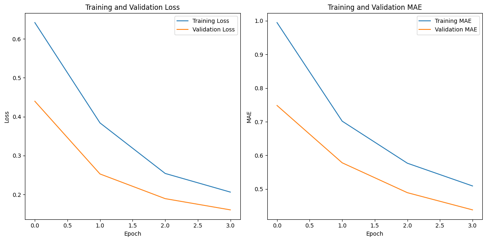

# Electric Power Consumption Prediction
### Overview
This project focuses on predicting electric power consumption using machine learning, specifically a Long Short-Term Memory (LSTM) model. The dataset utilized is sourced from [Kaggle](https://www.kaggle.com/datasets/uciml/electric-power-consumption-data-set) and contains information about global active power, global reactive power, voltage, and sub-metering values over time.

### Results

**Model Performance**

The LSTM model was trained and evaluated on the provided dataset, showcasing promising results. Below are key performance metrics:
- Training Loss: 0.2060
- Training MAE: 0.5093
- Validation Loss: 0.1604
- Validation MAE: 0.4383

**Final Evaluation**
  
The final Mean Absolute Error (MAE) was compared against a predefined threshold. The result indicates:
- The final MAE (0.5093) is less than 10% of the data scale.

These results suggest that the LSTM model has successfully learned patterns in the time series data and provides reliable predictions for electric power consumption.

### Credits
This project was developed as part of the "Belajar Pengembangan Machine Learning" [Dicoding](https://www.dicoding.com/) project assignment. Credits go to the project contributors and the Belajar Pengembangan Machine Learning community.
